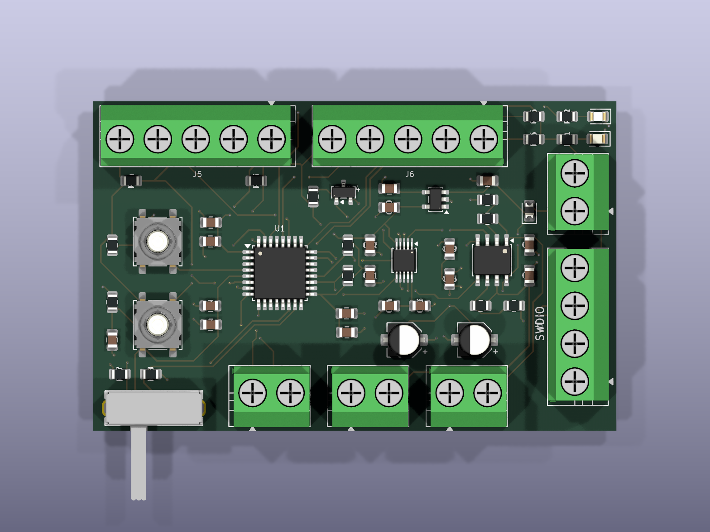
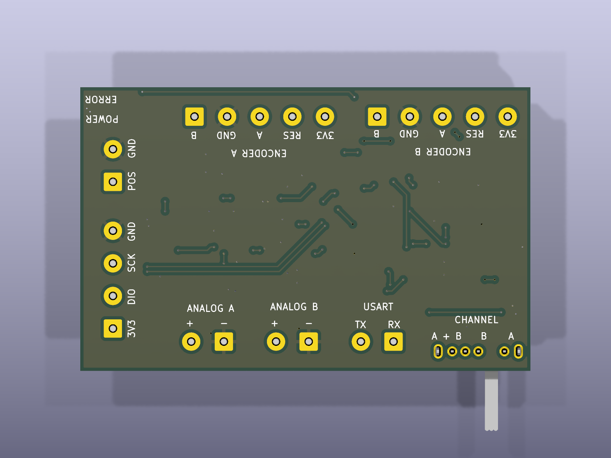
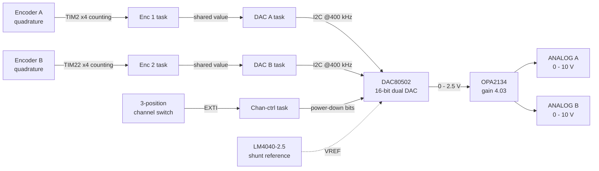
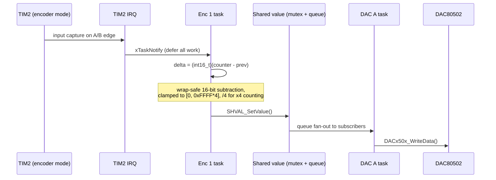

# STM32 Digital Potentiometer v2

A dual-channel, encoder-driven **0–10 V analog output generator** — a drop-in electronic replacement for the mechanical potentiometers used to feed 0–10 V control inputs (VFD speed references, dimmers, lab supplies, process controllers).

Two rotary encoders each drive an independent 16-bit DAC channel through a precision op-amp stage. Everything — the schematic, the PCB, the firmware, the DAC driver and the RTOS glue libraries — was designed from scratch: no CubeMX code generation, no vendor board support package, no third-party device drivers.

| | |
|---|---|
| **MCU** | STM32L031K6T6 — Cortex-M0+, 32 KB flash, 8 KB RAM |
| **RTOS** | FreeRTOS 10.2.1 (ARM_CM0 port, `heap_4`) |
| **Outputs** | 2 × 0–10 V, 16-bit, independently enabled |
| **Input** | 2 × quadrature rotary encoder + zero-reset button |
| **Board** | 2-layer, 69 × 43.5 mm, KiCad 9, all-SMD except connectors |
| **Build** | CMake + Ninja + `arm-none-eabi-gcc`, flashed with OpenOCD / ST-Link |
| **Footprint** | 26.1 KB flash (79.8 %), 5.5 KB RAM (66.7 %) — debug build, `-O0` |

<p align="center">
  
  
</p>

---

## Table of contents

- [How it works](#how-it-works)
- [Hardware design](#hardware-design)
  - [Analog signal chain](#analog-signal-chain)
  - [Power](#power)
  - [Connectors and controls](#connectors-and-controls)
  - [MCU pin map](#mcu-pin-map)
  - [Board](#board)
- [Firmware architecture](#firmware-architecture)
  - [Task model](#task-model)
  - [Data flow](#data-flow)
  - [Clock tree and timebases](#clock-tree-and-timebases)
  - [Error handling](#error-handling)
- [Libraries written for this project](#libraries-written-for-this-project)
- [Building and flashing](#building-and-flashing)
- [Repository layout](#repository-layout)
- [Status and next steps](#status-and-next-steps)

---

## How it works

Turning an encoder moves a 16-bit counter. That counter is the DAC code: one detent = one LSB. The code travels through a mutex-protected shared value that fans out to whichever task is subscribed to it, the DAC task pushes it to a TI DAC80502 over I²C, and an OPA2134 gain stage lifts the DAC's 0–2.5 V into the industrial 0–10 V range.

Nothing polls. Encoder edges, channel-enable changes and reset presses all arrive as interrupts that convert into FreeRTOS task notifications; every task spends its life blocked on `portMAX_DELAY`, so the MCU sits in the idle task at 4.19 MHz whenever the user is not touching anything.



---

## Hardware design

Full schematic: **[docs/schematic.pdf](docs/schematic.pdf)** ([SVG](docs/images/schematic.svg)) · KiCad sources: [`digital_potentiometer_v2_pcb/`](digital_potentiometer_v2_pcb) (submodule → [ikok07/digital_potentiometer_v2_pcb](https://github.com/ikok07/digital_potentiometer_v2_pcb))

### Analog signal chain

| Stage | Part | Design notes |
|---|---|---|
| Reference | **LM4040DBZ-2.5** shunt reference, biased through a 220 Ω resistor from 3V3 | An external reference was chosen over the DAC's internal one to decouple output accuracy from the LDO |
| Conversion | **DAC80502** — dual 16-bit I²C DAC, A0 tied low (address `0x48`) | Configured for VREF ÷ 2 with a ×2 output buffer gain, giving a clean 0–2.5 V full scale that stays inside the 3.3 V rail |
| Buffer / gain | **OPA2134** dual FET-input op-amp, one non-inverting stage per channel | 10 kΩ / 3.3 kΩ feedback → gain **4.03**, mapping 2.5 V full scale to ≈10.1 V. A 100 pF cap to ground on each output tames the cable capacitance seen by a screw terminal |
| Output | Screw terminals, one per channel | Op-amps run from the *unregulated* input rail, so the supply must exceed the target output by the OPA2134's headroom (≈12 V in for a full 10 V swing) |

Resolution works out to 38.1 µV per LSB at the DAC, ≈154 µV at the terminal.

### Power

A single DC input (screw terminal) passes through a series diode for reverse-polarity protection, then splits:

- **Analog rail** — raw input, feeding the OPA2134 directly so the output stage keeps its headroom.
- **Digital rail** — a **MIC5205-3.3** LDO (rated to 16 V in) produces 3V3 for the MCU, the DAC and the reference, with a 470 pF bypass on the noise-reduction pin and bulk + ceramic decoupling on both sides.

Every IC has its own 100 nF, with 1 µF/10 µF bulk local to the LDO, the reference and the DAC.

### Connectors and controls

All I/O is on 5.00 mm screw terminals so the board can be wired into a panel without connectors or crimps. The bottom silkscreen carries the full pinout, so the board is self-documenting once installed.

| Ref | Terminal | Pins |
|---|---|---|
| `J7` | Power in | POS, GND |
| `J5` / `J6` | Encoder A / B | B, GND, A, RES, 3V3 |
| `J3` / `J4` | Analog out A / B | +, − |
| `J1` | SWD programming header | 3V3, DIO, SCK, GND |
| `J2` | USART (debug / future host control) | TX, RX |

| Ref | Control | Function |
|---|---|---|
| `SW3` | 3-position slide switch | Selects which outputs are live: **A**, **B**, or **A + B** |
| `SW1` | Tactile | MCU reset |
| `SW2` | Tactile | BOOT0 — enters the ST system bootloader |
| `D2` / `D3` | LEDs | Power / fault |

Encoder A and B lines carry 10 kΩ pull-ups on the board; the channel-enable lines carry 10 kΩ pull-downs so an unpopulated switch defaults to *outputs off*.

### MCU pin map

| Pin | Signal | Peripheral |
|---|---|---|
| PA0 / PA1 | `ENC1_A` / `ENC1_B` | TIM2 CH1/CH2 — encoder mode |
| PA6 / PA7 | `ENC2_A` / `ENC2_B` | TIM22 CH1/CH2 — encoder mode |
| PA9 / PA10 | `I2C_SCL` / `I2C_SDA` | I²C1, fast mode (400 kHz) |
| PA2 / PA3 | `USART_TX` / `USART_RX` | USART2 (header only) |
| PA13 / PA14 | `SWDIO` / `SWCLK` | Debug |
| PB0 / PB1 | `CH1_EN` / `CH2_EN` | EXTI0_1 — channel switch |
| PB4 / PB5 | `ENC1_RES` / `ENC2_RES` | EXTI4_15 — zero-reset buttons |
| PB7 | `ERROR_LED` | GPIO output |

### Board

2-layer, 69 × 43.5 mm, 55 footprints, 93 vias, a solid ground pour on the bottom layer, and all active parts on the top side for single-sided assembly. Analog outputs, the reference and the DAC are grouped away from the digital section, and the two 5-pin encoder terminals sit on the opposite edge from the analog terminals to keep encoder switching noise off the output lines.

---

## Firmware architecture

The application is deliberately layered: `Src/` holds application modules (`dac`, `encoder`, `i2c`, `power`, `error`), `Src/msp/` holds the HAL's board-support callbacks (pin muxing, clock enables, NVIC setup) so pin assignments live in exactly one place, and `lib/` holds reusable, hardware-agnostic components. There is no CubeMX-generated code anywhere — the HAL and CMSIS trees are vendored from ST, everything on top of them is hand-written.

All mutable state lives in a single `APP_State` struct (`Include/app_state.h`): peripheral handles, task descriptors and the shared values. There are no scattered globals, and any module can reach exactly what it needs through `gAppState`.

### Task model

| Task | Prio | Stack | Blocks on | Job |
|---|---|---|---|---|
| `ENC 1 Task` | 5 | 256 w | Task notification | Convert TIM2 counter deltas to a DAC code |
| `ENC 2 Task` | 5 | 256 w | Task notification | Convert TIM22 counter deltas to a DAC code |
| `DAC CHCTRL Task` | 5 | 256 w | Task notification | Read the channel switch, power outputs up/down |
| `DAC A Task` | 4 | 256 w | Subscriber queue | Write channel A over I²C |
| `DAC B Task` | 4 | 256 w | Subscriber queue | Write channel B over I²C |

Input tasks outrank output tasks, so a user turning the knob is never delayed by an in-flight I²C transaction.

### Data flow



Two details worth calling out:

- **Wrap-safe counting.** The timer counter is free-running 16-bit. Casting the difference to `int16_t` makes the arithmetic correct across the 0 ↔ 0xFFFF boundary in both directions, with no special-casing.
- **Latest-value semantics.** `SHVAL_SetValue` resets the subscriber queue before publishing, so a DAC task that fell behind during a fast spin wakes up to the *current* position rather than replaying a backlog of stale codes.

### Clock tree and timebases

MSI at 4.194 MHz drives SYSCLK with all prescalers at ÷1 and zero flash wait states — the lowest clock that still clears the 400 kHz I²C bus comfortably, chosen because the workload is entirely event-driven.

FreeRTOS keeps SysTick for its own tick, so `HAL_InitTick()` is overridden to run the HAL's 1 ms timebase on **TIM21** instead. This avoids the classic Cube pitfall of two schedulers fighting over one timer.

### Error handling

A fault path is deliberately loud and simple: `ERROR_Trigger()` lights the fault LED, `ERROR_TriggerFatal()` lights it, disables interrupts and halts. It is wired to every initialisation failure in `main()`, to the DAC driver's error callback, and to FreeRTOS's `vApplicationStackOverflowHook`, so a stack overflow surfaces as a lit LED rather than silent corruption.

---

## Libraries written for this project

Three components were factored out as standalone, reusable libraries rather than being written inline:

**[`DAC_X050X`](https://github.com/ikok07/dac_x050x-generic-driver)** — a portable driver for TI's whole DACx050x family (DAC60501/70501/80501/60502/70502/80502). Device selection is a compile-time define that sets resolution and channel count; the platform binding is three callbacks (`I2CSend`, `I2CRead`, `LogError`), so the same driver runs on STM32 HAL, Arduino or ESP-IDF unchanged. Covers the full register map: gain, reference divider, internal/external reference, per-channel power-down, LDAC-synchronised and broadcast updates, and the reference alarm.

**[`shared_values`](https://github.com/ikok07/stm32_shared_values)** — a small publish/subscribe primitive for RTOS tasks. A value is guarded by a mutex and paired with a subscriber queue; writers call `SHVAL_SetValue()` with a timeout and every subscriber is woken with the newest value. It removes the usual pile of ad-hoc queues and volatile globals between producer and consumer tasks.

**`tasks_scheduler`** — a thin descriptor layer over `xTaskCreate`, so tasks are declared as data (name, priority, stack depth, entry point, args) in one place and their handles live in the application state struct alongside everything else.

---

## Repository layout

```
Include/            Application headers (dac, encoder, i2c, power, error, app_state)
Src/                Application modules
  msp/              HAL board-support callbacks — all pin muxing and NVIC setup
lib/
  DAC_X050X/        DACx050x driver (submodule)
  shared_values/    RTOS pub/sub primitive (submodule)
  tasks_scheduler/  Task descriptor layer
  FreeRTOS/         Kernel sources
  FreeRTOS_Port/    ARM_CM0 port, heap_4, FreeRTOSConfig.h
  HAL/ CMSIS/       Vendored ST HAL and CMSIS
digital_potentiometer_v2_pcb/   KiCad 9 project (submodule)
docs/               Schematic PDF, renders, component datasheets
STM32L031XX_FLASH.ld, startup_stm32l031xx.s, gcc-arm-none-eabi.cmake, openocd.cfg
```

---

## Author

**Kaloyan Stefanov** — firmware, schematic, PCB layout and the supporting libraries.

